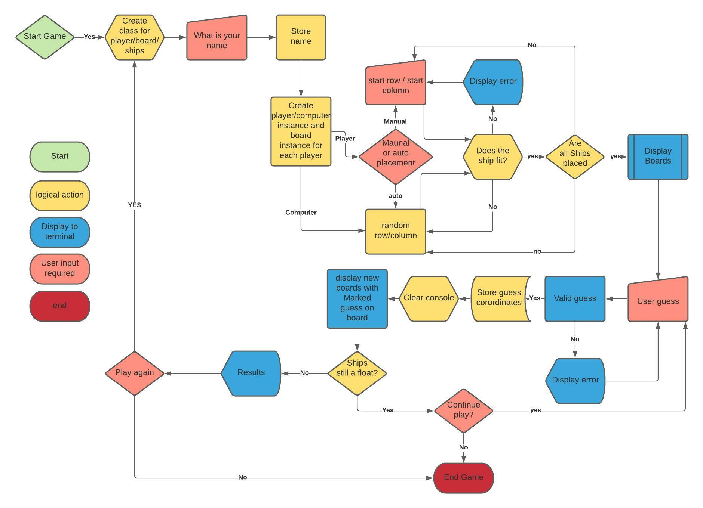

# Ocean battalion
This game is a take on the original board game battle ship. Based inside of a mock terminal deployed via Heroku.

The scene begins you are in deep waters. Mid sea battle the command comes in over the telegraph that the war is over, trouble is you still have some ammunition left and there are rounds left in the chamber... it would be irresponsible to leave live rounds in the chamber. To be a good captain and save your own men from accidental onboard detonation you agree to fire "randomly" into the sea. Trouble is the other sides fleet captain had the same idea.....

With both sides racing to release all their rounds (and some extra that "slipped" into the torpedo chamber when the last one was fired :wink:) the obvious winner is the last man standing. The war may be over but this battle has just begun!

Choose a quick start for the your ships to be randomly placed or select your battle arrangement manually. Whatever you decide may the tides of fortune forever be in your favor.

## Game Logic

## How to play

Firstly select your strategy:  

Place your fate in the hands of the sea god Neptune :merman: and let the currents randomly position your ships before you anchor.   

Or  

Choose to spite the sea god and place your ships before dumping your excess rounds into the enemy... I mean the sea.  

Once the positions are set, its time to let a rip. Since the radar equipment was broken "accidentally" in the previous battle, you are firing blind and cannot see the other sides ships, choose your co ordinates on the map (row, column) and remember to call "FIRE IN THE HOLD" (safety first after all). The results of you turn will be indicated as follows:  

Hit = :boom:  
Miss = :ocean:

Once a ship is sunk the whole ship will convert from :boom: to :diving_mask:

Last side with a ship still afloat wins.

# To be deleted when finally deployed

Welcome USER_NAME,

This is the Code Institute student template for deploying your third portfolio project, the Python command-line project. The last update to this file was: **August 17, 2021**

## Reminders

* Your code must be placed in the `run.py` file
* Your dependencies must be placed in the `requirements.txt` file
* Do not edit any of the other files or your code may not deploy properly

## Creating the Heroku app

When you create the app, you will need to add two buildpacks from the _Settings_ tab. The ordering is as follows:

1. `heroku/python`
2. `heroku/nodejs`

You must then create a _Config Var_ called `PORT`. Set this to `8000`

If you have credentials, such as in the Love Sandwiches project, you must create another _Config Var_ called `CREDS` and paste the JSON into the value field.

Connect your GitHub repository and deploy as normal.

## Constraints

The deployment terminal is set to 80 columns by 24 rows. That means that each line of text needs to be 80 characters or less otherwise it will be wrapped onto a second line.

-----
Happy coding!