# **Batleships**

## **Overview**
This program is a computerized version of the original board game battleships, based inside a mock terminal deployed via Heroku.

As a child of the 90's, I used the traditional ship naming conventions from the 1990 Milton Bradley game version over the more modern Hasbro rendition. One can find more info on the rules and the history of the game here on [Wikipedia](https://en.wikipedia.org/wiki/Battleship_(game)). My only deviation was that I renamed the "Carrier" to "Aircraft carrier" to differentiate it from the Cruiser on the board within the app.  

The app replicates the game's enjoyment by allowing the user to play a single-player version against a computerized player.  
  
[Click here to be taken to the final deployment of the project.](https://dnlbowers-battleship.herokuapp.com/)

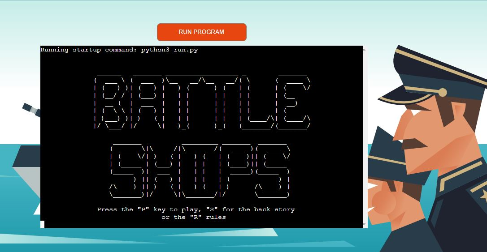

## **Table of Contents**
* [**Batleships**](#batleships)
  * [**Overview**](#overview)
  * [**Table of Contents**](#table-of-contents)
  * [**How to Play:**](#how-to-play)
    * [***Firstly Select your Strategy (Setup Phase):***](#firstly-select-your-strategy-setup-phase)
    * [***Firing Round:***](#firing-round)
    * [***How to Win:***](#how-to-win)
* [**Planning Phase:**](#planning-phase)
  * [***User Stories:***](#user-stories)
  * [***Site Aims:***](#site-aims)
  * [***How Will This Be Achieved:***](#how-will-this-be-achieved)
  * [***Game Flow Chart:***](#game-flow-chart)
* [**Features**](#features)
  * [**Welcome Screen:**](#welcome-screen)
    * [**Back Story:**](#back-story)
    * [**Rules:**](#rules)
  * [**Once Play Game is Selected (Game set up):**](#once-play-game-is-selected-game-set-up)
    * [**Player Name Input(With Error Handling):**](#player-name-inputwith-error-handling)
    * [**Select Setup type (with error handling):**](#select-setup-type-with-error-handling)
    * [**Manual placement:**](#manual-placement)
      * [***Aircraft Carrier:***](#aircraft-carrier)
      * [***Battleship:***](#battleship)
      * [***Cruiser:***](#cruiser)
      * [***Submarine:***](#submarine)
      * [***Destroyer:***](#destroyer)
    * [**Error handling phase during manual set up:**](#error-handling-phase-during-manual-set-up)
      * [***Directional Input Error Handling:***](#directional-input-error-handling)
      * [***Ship already in intended space:***](#ship-already-in-intended-space)
      * [***Start tiles selected to close to the board edge:***](#start-tiles-selected-to-close-to-the-board-edge)
    * [***Quickstart (auto placement):***](#quickstart-auto-placement)
  * [**Error handling common to both setup and gameplay:**](#error-handling-common-to-both-setup-and-gameplay)
    * [***Coordinate Input Error Handling:***](#coordinate-input-error-handling)
  * [**Once all ships are placed (Firing Round):**](#once-all-ships-are-placed-firing-round)
    * [***Battle Commencement screen:***](#battle-commencement-screen)
    * [**Duplicate Guess Check:**](#duplicate-guess-check)
    * [**Notification of Hit Result:**](#notification-of-hit-result)
    * [**Notification of Miss Result:**](#notification-of-miss-result)
    * [**End game prematurely:**](#end-game-prematurely)
    * [**Player Win Screen:**](#player-win-screen)
    * [**Computer Win Screen:**](#computer-win-screen)
* [**Future-Enhancements**](#future-enhancements)
  * [***Multiplayer:***](#multiplayer)
  * [***Improved AI Intelligence:***](#improved-ai-intelligence)
  * [***Improved Visuals:***](#improved-visuals)
    * [***Audio:***](#audio)
    * [***Randomize the Starting Player***](#randomize-the-starting-player)
* [**Data Model**](#data-model)
  * [**Overview of Classes:**](#overview-of-classes)
  * [**Logic Flow:**](#logic-flow)
    * [***Set up Phase:***](#set-up-phase)
    * [***Firing Rounds:***](#firing-rounds)
* [**Testing Phase**](#testing-phase)
* [**Libraries**](#libraries)
    * [***random:***](#random)
    * [***os:***](#os)
    * [***getch:***](#getch)
    * [***string:***](#string)
* [**Deployment**](#deployment)
* [**Honorable Mentions**](#honorable-mentions)
* [**Credits**](#credits)

## **How to Play:**

### ***Firstly Select your Strategy (Setup Phase):***  

Place your fate in the hands of the sea god Neptune. Press "q" or type "quick" to let the currents randomly position your ships before you anchor and fire.   

Or  

Before opening fire, choose to spite the sea god and place your ships strategically yourself by pressing "m" or typing "manual".

Neptune's hand will always guide the computerized fleet only to reveal their location with the flames as you hit one.

### ***Firing Round:***  

Once in position, it's time to let rip. Since the radar equipment was broken "accidentally" in the previous battle, you are firing blind and cannot see the other side's ships, choose your coordinates on the map (row , column) and remember to call "FIRE IN THE HOLD" (safety first after all).  

The results of your guess are indicated as follows:  

Hit = :boom:   
Miss = :ocean:  

### ***How to Win:***
The last side with a ship still afloat wins. 

# **Planning Phase:**
## ***User Stories:***
As a user, I want to be able to:
* See clearly from the offset what the game is.
* Have a straightforward way to read the game instructions from within.
* To access a fun story setting the scene of the game.
* Play an enjoyable game of the classic game battleships by myself.

## ***Site Aims:***
The site aims to:
1. Make it clear what the game is without the need for further explanation from external sources.
1. Communicate a clear and appropriate response to all user inputs.
1. Continue in a loop without ever crashing due to an error caused by the user's input.
1. Allow the user to have an enjoyable experience playing battleships by themselves.
  
## ***How Will This Be Achieved:***
To achieve the above, the site will:
1. Provide a welcome screen with the game name in ascii art.
    * Offer the user a chance to read the rules and back story before starting the game.
1. Ensure that all user input provides an appropriate response.
1. Any time the user input is not as expected by the game, the app will show a message to inform the user that their entry was invalid and guide them on how to input as expected.
1. Executing all of the above in a way that successfully replicates the original board game of battleships.

## ***Game Flow Chart:***
To understand the steps required in order to program the game, I created the below flowchart using [lucid charts](https://www.lucidchart.com/).  

 

# **Features**
 
## **Welcome Screen:**
From the welcome screen, the user has access to three things: -
* Game rules/How to play.
* Back Story.
* Start the game.  
  
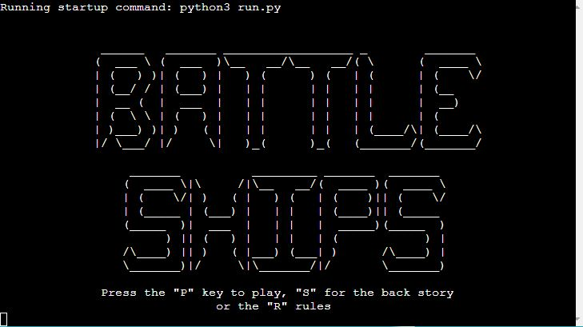

### **Back Story:**
I created a brief back story to add an element of fun to the game.  

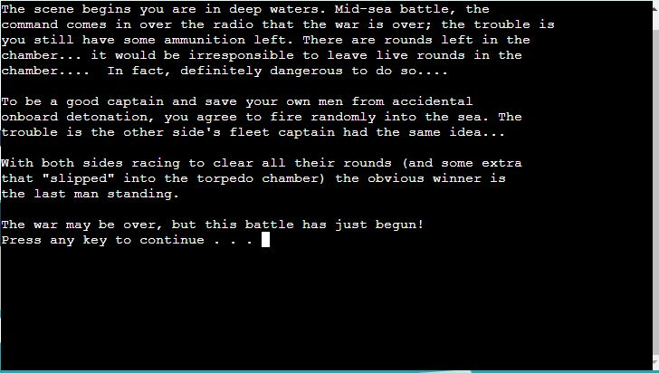

### **Rules:**
The rules consist of the following two stages with a pause("press any key") in between to give the user enough time to read them: - 
* #### *Page 1 (Setup Phase):*  
  
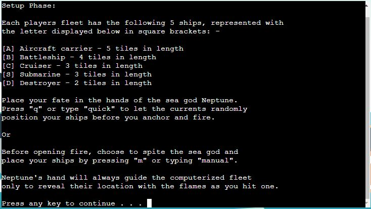

* #### *Page 2 (Firing Round):*
   
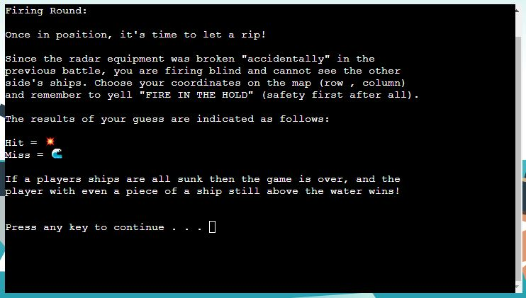

## **Once Play Game is Selected (Game set up):**
### **Player Name Input (With Error Handling):**
The user is required to input their name. As with standard conventions in the English language, the app will capitalize the first letter of each name(even if more than one).

The error handling covers two scenarios: 
1. They cannot leave the name blank.
   * To avoid cheating with blank spaces, this check is made by checking if the string length is zero when stripped of all space characters. This way, it still allows a user to enter first and last names with a space between them.
1.  By using the inbuilt function, lower(), the user will not be allowed to enter the name "computer" in any casing.     
   
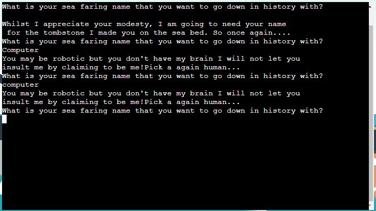

### **Select Setup Type (With Error Handling):**
The user is offered two methods for placing their ships:
1. Quickstart:  
   * Places the user ships automatically and at random to allow the user to jump straight into the action.
1. Manual placement:
   * Places each ship in their chosen location as pictured in the below screenshots.

The user will only be able to enter "Q", "Quick", "q", "quick", "M", "Manual", "m" or "manual". Failure to input one of these words/characters will result in the error message pictured below.

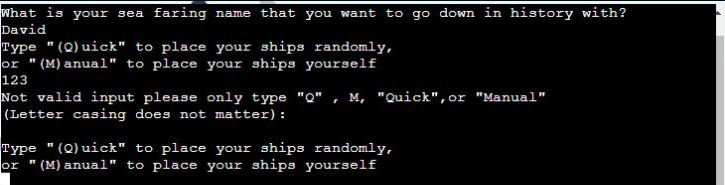

* The computer's fleet will always be positioned using the above randomized placement method.

### **Manual Placement:**
When choosing to place their ships manually the user will be shown two blank boards. The board on the left will be where they place their ships the right board will be used later to track their guesses.

The user will be informed of:
* Which ship they are about to place.
* How many tiles the ship requires to be placed.
* What to enter and how it is expected to be entered.

The user will be requested for a start coordinate and the direction the ship should face. This step is repeated five times one for each ship types and shown below.

#### ***Aircraft Carrier:***

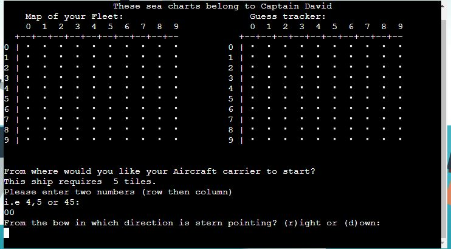

#### ***Battleship:***

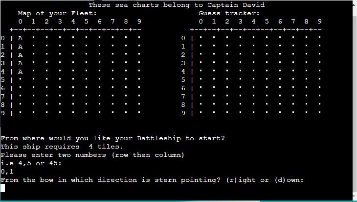

#### ***Cruiser:***

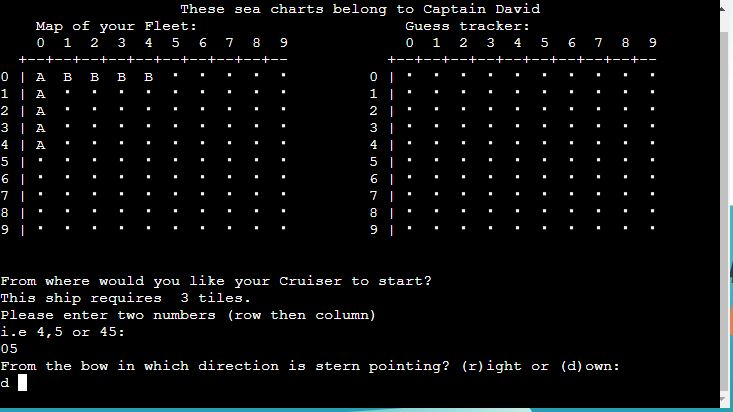

#### ***Submarine:***

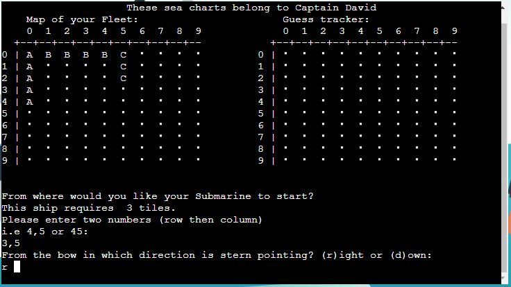

#### ***Destroyer:***

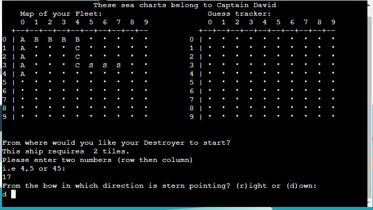

### **Error Handling During manual Setup Phase:**

#### ***Directional Input Error Handling:***
If the user enters invalid input, the app will show the below message, and a new start coordinate will be requested.

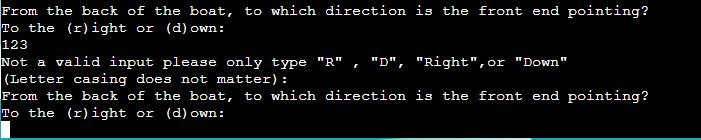

#### ***Ship Already in Intended Space:***
The algorithm will continue to place the ship symbol in the requested direction until the number of tiles equals the ship length. Should a ship already be placed in the path attempted, then the user will see the below message: 

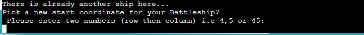

#### ***Start Tiles Selected to Close to the Board's Edge:***
Should either the row or column number exceed nine during the placement process, the app will show the user the below error:  

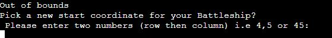

### ***Quickstart (Auto Placement):***
The quick start follows the same process as above except all inputs are randomized and only the end result is shown to the user (see Battle Commencement Screen below)

## **Error Handling Common to Both Setup and Gameplay:**

### ***Coordinate Input Error Handling:***
This check is used throughout the game to ensure the input coordinates from the player match the expected input without error. When the player does input something that does not fit the required input, the app will present them the following error: 

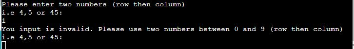

## **Once all Ships are Placed (Firing Round):**

### ***Battle Commencement screen:***
Once the setup is complete, the user gets informed the battle will start. The indicates the player to fire.

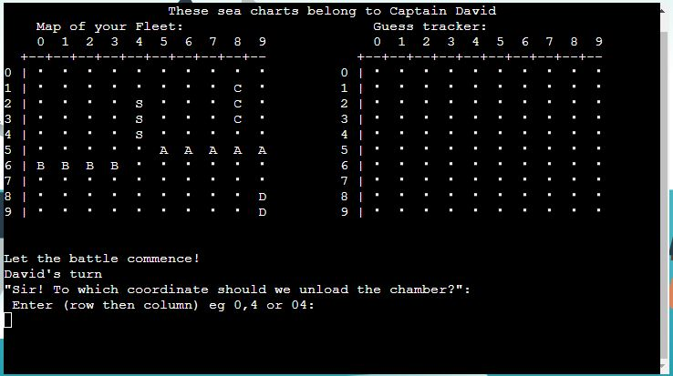

### **Duplicate Guess Check:**
Should a player try to guess a tile that they have already guessed in a previous turn, they will be presented with the following error:   

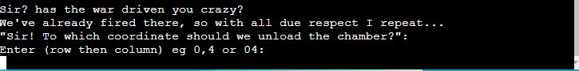

### **Notification of Hit Result:**
Hits will be indicated with a message and a :boom: emoji.

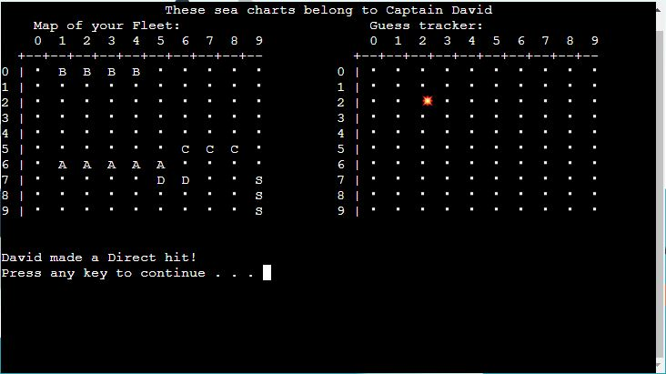

### **Notification of Miss Result:**
Misses will be indicated with a message and a :ocean: emoji.
  
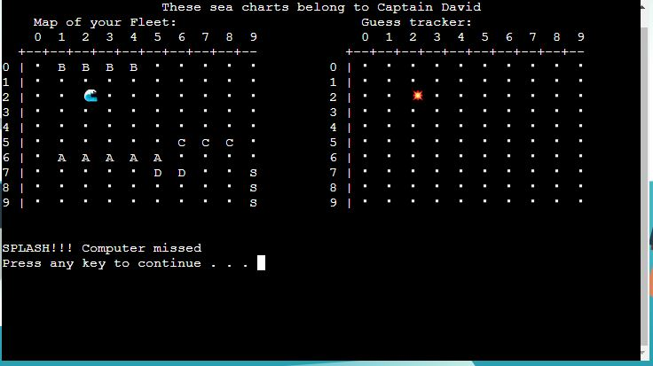

### **End game prematurely:**
After every turn, the player gets offered a chance to leave the game. The player may use this option if they felt the odds were not in their favor and didn't want to face defeat.  

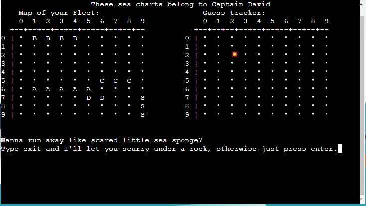

### **Player Win Screen:**
When the player has successfully guessed the location of all of the computer's ships the following message is displayed:   

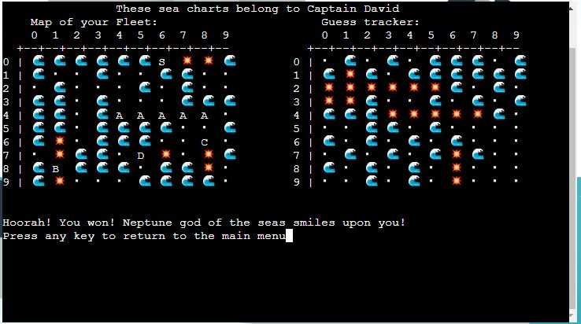
  
### **Computer Win Screen:**
When the computer has successfully guessed the location of all of the player's ships the following message is displayed: 

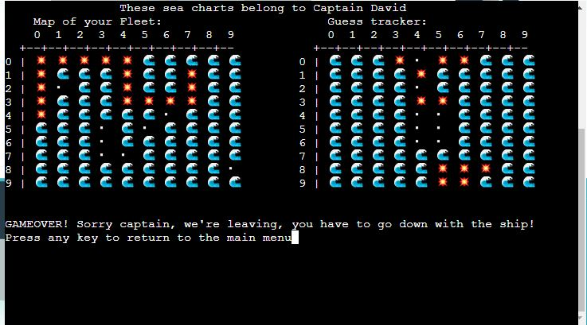

## **Future-Enhancements**
I wanted to do a lot more with this game. Sadly, however, as with every project, there was a deadline to meet. Below are the things which would take my current MVP to the next level: -

### ***Multiplayer:***
  * The user would be asked how many were playing the game. If the user selected two players, the game would request a second username. If not, the game would generate the computer opponent automatically as it is in the current version of the game.
  * Due to the requirement of not seeing the opponent board, this would implement an interval screen between turns with a pause function until the opposing player had confirmed they could see the screen alone.
  
### ***Improved AI Intelligence:***
   * Create an algorithm to see the last hit guess and search the surrounding tiles on the proceeding guesses. 
   * Having separate algorithms to allow the user to select a difficulty level. i.e., easy would be as it is now, completely random, and hard would be it tracks hits on a ship until it is sunk much like a human player would.
### ***Improved Visuals:***
   * Add colors within the console using the external Colorama library.
   * One thing I would have loved to do for this project is incorporate some Javascript to animate a background where the user would see a missile or torpedo head towards a ship and explode for a hit or splash in the water for a miss. This feature was well outside of the scope of the assessment criteria but something I will be coming back to try and implement later on.
  
### ***Audio:***   
   * Adding sound effects for missile fire, hit, and miss.
   * 80's type midi music file to make it into a retro-type arcade game.
  
### ***Randomize the Starting Player***  
   * Currently, the starting player is always the first initiated. I want to come back and add a randomized method that allows this to change from game to game. i.e., dice roll (highest number goes first) or a coin toss.

# **Data Model**
## **Overview of Classes:**
Throughout this project, I have opted to use Object Orientated programming. The game consists of four classes and five subclasses: -
  1. Player.
  2. Board.
  3. Ship.
     * AircraftCarrier.
     * Battleship.
     * Cruiser.
     * Submarine.
     * Destroyer 
  4. Game.

To avoid repetition, I created two mixins for methods required in more than one class and passed them to the required class as a parameter: -
  1. InputMixin
  1. ClearDisplayMixin

## **Logic Flow:**
The game object gets created in the global scope and calls the welcome screen using dot notation. The user can read the introductory story, the rules or initialize the game. Entering either rule or story will bring the user to the main menu once read.

Once the player presses "p" to play, the set player's method is called from the game class and creates the player objects. The first object is created by asking the user for their name. The second gives a parameter the string  "Computer" by default. As part of the error handling for the name input, the user cannot enter their name as "Computer".

### ***Setup Phase:***
The generation of a player object then automatically begins the game's setup phase via the init methods of both the Player and Board class. 

Once we have a player object (in this case, two), they then require their board and fleet of ships to place upon it. The Player class initiates the Board class by passing in the parameters to tell the board class if the possessing player will be a computer or not and if they will be using auto set up. 

By default, the board will be a 10 x 10 size grid as in the original version of the game and will always have five ships to be placed on it. The initialization of the board from the Player instance then builds two boards; one for tracking guesses and one for placing their fleet. Once it has somewhere to put the ships, it then proceeds to build the five ship objects from the five subclasses of Ship and places them in a list to keep track of its fleet belonging to the specific player objects board object.  Each ship is initiated with a start coordinate, direction, empty list for eventual damage tiles to be updated, and the entire ship coordinates. In the case of my program, the ship object is initiated using the start coordinate twice, and the remaining coordinates are added after the ship has been built fully to the correct length during the placement process. Each Ship subclass has its own uniquely defined length, symbol, and name.

In this way, we have four separate object types which belong to one another but are also distinct in the same two players, the boards they use, and the ships they place are all related but separate in a real-life game of battleships.
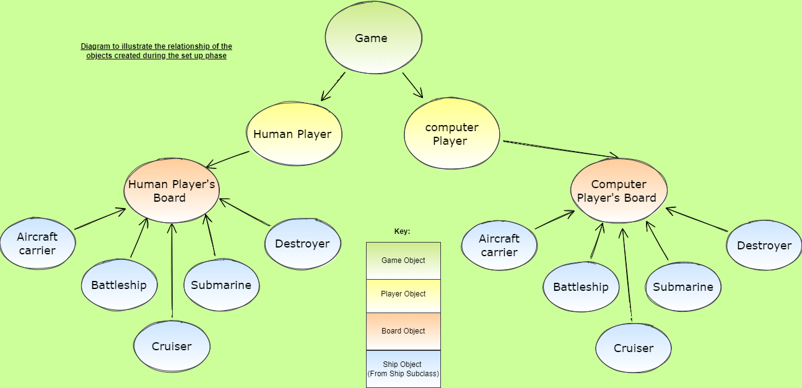

### ***Firing Rounds:***
After creating all the objects, it's time to bring them to life and interact. The firing round method from the Game object is called using both player objects as parameters.

The above method runs on repeat using a while loop until either player's objects board has no more ships afloat. It uses constructors to call the instance methods of the player and their board to take a guess, cross-reference their opponent's board to display the result (hit or miss). 

After each player's turn, it checks the number of ships still afloat on the opponent's board.  If zero ships are left on the opponent's board, the game prints a win statement to announce who won and breaks the while loop; the game gets restarted by deleting the player objects, clearing the screen, and returning the user to the welcome screen. 

The game object continues to exist at all times so that the user never needs to refresh the page. 

# **Testing Phase**
I have included details of testing both during development and post development in a separate document called [TESTING.md](TESTING.md).

# **Libraries**
For this project to work, I required four imported libraries: -
### ***random:***
  * randint used to generate a random number between 0 and 9 for the automated placement and computer guessing
### ***os:***
  * system used in conjunction with the clear/cls command to clear the console so the user would not get overwhelmed in reams of outdated data from previous rounds
### ***getch:***
  * pause imported from getch to pause the gameplay and give the user more control between turns. This function will also later allow two human players to use the same screen to play against each other. A blank screen could implement this between player turns and a pause until the new player is in play and the previous player has looked away.
### ***string:***
   * This was imported to use the string.capwords() method on the name input. This method means that the user's name will always display with the proper casing.

# **Deployment**
The project was deployed to [Heroku](https://www.heroku.com) using the below procedure:- 

1. From the [GitHub repository](https://github.com/dnlbowers/battleships), clone the project into Vscode or launch Gitpod to open it as a project workspace.
1. Generate the projects **requirements.txt** file with the console command "pip3 freeze > requirements.txt"
   * ***IMPORTANT*** If developing on a local machine with Vscode, ensure you set up/activate the virtual environment before generating the requirements.txt file; otherwise, all the dependencies installed on the device will be listed and not just the dependencies required for this project.
1. **Log in to Heroku** or create an account if required.
1. **click** the button labeled **New** from the dashboard in the top right corner, just below the header.
1. From the drop-down menu **select "Create new app"**.
1. **Enter a unique app name**. I combined my GitHub user name and the game's name with a dash between them (dnlbowers-battleship) for this project.
1. Once the web portal shows the green tick to confirm the name is original **select the relevant region.** In my case, I chose Europe as I am in Malta.
1. When happy with your choice of name and that the correct region is selected, **click** on the **"Create app" button**.
1. This will bring you to the project "Deploy" tab. From here, navigate to the **settings tab** and scroll down to the **"Config Vars" section**. 
1. **Click** the button labelled **"Reveal Config Vars"** and **enter** the **"key" as port**, the **"value" as 8000** and **click** the **"add"** button.
1. Scroll down to the **buildpacks section of the settings page** and click the button labeled **" add buildpack," select "Python," and click "Save Changes"**.
1. **Repeat step 11 but** this time **add "node.js" instead of python**. 
   * ***IMPORTANT*** The buildpacks must be in the correct order. If node.js is listed first under this section, you can click on python and drag it upwards to change it to the first buildpack in the list.
1. Scroll back to the top of the settings page, and **navigate to the "Deploy" tab.**
1. From the deploy tab **select Github as the deployment method**.
1. **Confirm** you want to **connect to GitHub**.
1. **Search** for the **repository name** and **click** the **connect** button next to the intended repository.
1. From the bottom of the deploy page **select your preferred deployment type** by follow one of the below steps:  
   * Clicking either "Enable Automatic Deploys" for automatic deployment when you push updates to Github.  
   * Select the correct branch for deployment from the drop-down menu and click the "Deploy Branch" button for manual deployment. 

# **Honorable Mentions**
* [Mark Cutajar](https://github.com/markcutajar) - Truly, if Data Science were a superpower, Mark would be the equivalent of Superman. He was with me at several points throughout the development process and was always on call when I needed him to cross-reference my ideas.  
* [Richard Wells](https://github.com/D0nni387) - Taught me what it means to have a mentor. Richard has always been perfect for me as a mentor on this learning journey; however, I understood how to use him to his full potential during this project. Our relationship feels like it has blossomed into junior and senior developers on the same team.  
* [Sean Murphy](https://github.com/nazarja) - Provided me a runnable example I required to print two boards side by side. Not only did he give me exactly what I needed, but he spent the necessary time to break it down and explain it step by step so that I understood the code and was able to adapt it to my project without issue.  
* [Matt Bodden](https://github.com/MattBCoding) - Matt helped me understand how to document the data model in the readme and converted my background image from a .ai file format to a .svg format using adobe illustrator. Generally Matt is always just always a top man in a time of need.  
* [Steven Weir](https://github.com/StevenWeir038) -  Steven did not directly help with the code. However, since we began the course together, he has gone out on his way to check in with me intermittently, and I cannot express how much this sense of camaraderie has brought me through some challenging moments and especially for this project. I am not sure how he does it, but he always pops up at the exact moment I need a nice collection of alphanumeric characters to connect with and relate to.
* [Shellie Downie](https://github.com/shellieD) - Shellie heard my plea for a proofreader and could resist. I have a paid version of Grammarly, and she still managed to pick up on multiple errors in my readme. Given the size of my readme, I was blown away by how generous Shellie was.
* The Code Institute Slack community as a whole who tested and supported throughout.
* And the **biggest thanks goes to** my wife and child, who have had to deal with me face to face through it all. **Oliver** has been my reason for the change and **Analise** my inspiration. 

# **Credits**
* Python OOP Tutorial series by Corey Schafer for general reference on working with classes and OOP in general  - [First of six videos in the series](https://youtu.be/ZDa-Z5JzLYM)  
* To get a general idea of the game logic, I used this video on the [Devpost Youtube channel](https://youtu.be/zSQIGzmcp2I)  
* The idea to decorate the board with numbers above and to the side came from [Knowledge Mavens youtube channel](https://youtu.be/alJH_c9t4zw)
* Clear console function copied from [delftstack.com](https://www.delftstack.com/howto/python/python-clear-console/)
* How to make a pause for a key to be pressed I referenced from [pretagteam.com](https://pretagteam.com/question/python-press-any-key-to-exit)
* [lucid chart.com](https://www.lucidchart.com/) was used to create the game flow chart "flowchart.jpeg"
* [Draw.io](https://app.diagrams.net/) was used to create the setup of objects diagram "objects.drawio.png"
* [Code Institute](https://codeinstitute.net/) for providing the template. The [template](https://github.com/Code-Institute-Org/python-essentials-template) gave me a mock terminal to display my game via a webpage.
* [ASCII Art text generator](http://www.network-science.de/ascii/) used for the welcome screen text.
* Favicon image taken from [pixabay](https://pixabay.com/photos/battleship-us-navy-broadside-firing-79519/) under Pixabay License, Free for commercial use, No attribution required however the user who posted the image was "12019 / 10259 images"
* Unicode for the emoji's was taken from the [unicode.org emoji library](https://unicode.org/emoji/charts/emoji-list.html#1f4a5) 
* Background image was downloaded from [stock.adobe.com](https://stock.adobe.com/mt/Library/urn:aaid:sc:EU:7b501d7b-97a5-4e2a-8638-7d43341ae21b?asset_id=176108523) under the [standard license](https://stock.adobe.com/mt/license-terms)
* [stack overflow]() was used to resolve the [HTML error found by the validator](https://stackoverflow.com/questions/12150369/define-multiple-languages-in-html-root-elements-lang-attribute) and to find the [string library](https://stackoverflow.com/questions/1549641/how-can-i-capitalize-the-first-letter-of-each-word-in-a-string) to ensure the player name always showed with a capital at the start of each name entered.

