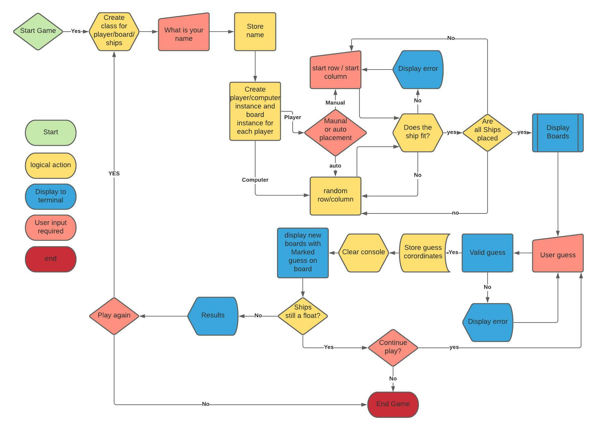

# Ocean battalion - https://dnlbowers-battleship.herokuapp.com/
This game is a take on the original board game battle ship. Based inside of a mock terminal deployed via Heroku.

As I was a child of the 90's I used the traditional ship naming conventions from the 1990 Milton Bradley game version over the more modern Hasbro rendition. More info on this, the rules and the games history can be found here on [Wikipedia](https://en.wikipedia.org/wiki/Battleship_(game))

The scene begins you are in deep waters. Mid sea battle the command comes in over the telegraph that the war is over, trouble is you still have some ammunition left and there are rounds left in the chamber... it would be irresponsible to leave live rounds in the chamber. To be a good captain and save your own men from accidental onboard detonation you agree to fire "randomly" into the sea. Trouble is the other sides fleet captain had the same idea.....

With both sides racing to release all their rounds (and some extra that "slipped" into the torpedo chamber when the last one was fired :wink:) the obvious winner is the last man standing. The war may be over but this battle has just begun!

Choose a quick start for the your ships to be randomly placed or select your battle arrangement manually. Whatever you decide may the tides of fortune forever be in your favor.

## Game Logic

## How to play

Firstly select your strategy:  

Place your fate in the hands of the sea god Neptune :merman: and let the currents randomly position your ships before you anchor.   

Or  

Choose to spite the sea god and place your ships before dumping your excess rounds into the enemy... I mean the sea.  

Once the positions are set, its time to let a rip. Since the radar equipment was broken "accidentally" in the previous battle, you are firing blind and cannot see the other sides ships, choose your co ordinates on the map (row, column) and remember to call "FIRE IN THE HOLD" (safety first after all). The results of you turn will be indicated as follows:  

Hit = :boom:  
Miss = :ocean:

Once a ship is sunk the whole ship will convert from :boom: to :diving_mask:

Last side with a ship still afloat wins.

##issues/testing (rough notes)

* Classes and sub classes, I was trying to figure out how to link all objects together. At first I was making all classes a sub class of "Player" The after much research I realized that board and ship were not types of player but something the player possessed. Realising this I made the board class part of the innit method in player so it Belonged to the player but was not a sub class of.

* I needed a way to check if a ship had already been place on a tile. I was trying to access the coordinates from the ship obj directly and bu simply using += to add to the list the was no definition between the set of coords (row, column). when I then realized the error saying that fleet[i].coordinates error saying it lack the append attribute I realized I could do  from with in the build fleet function using the predefined list and the coords used to innit the obj. after realising this I was able to use occupied_coordinates.append(tuple(random_start)) to place the row and column coordinate as a tuple set with in the predefined occupied_coordinates list.
  * This changed - go back to review

* When creating an object for the computer it was asking how it wanted to place the ships, this was fix with an if statement in the innit method of the class.

* When trying to determine within the build ship function with auto placement it was then asking the player to place ships manually. I found that this partly because I have placed the auto placement parameter after the *arg and was being added to the list of occupied tiles and as such it was failing to recognize us it auto placement or manual being past, Moving the parameter from the last to the first fix this,

* After trying to understand why it was not able to read the list within a list I search for iterating through a list of lists. I was then able to create a static method in the board class that searched each list within the list of occupied tiles and return True if the coord was found in one of the nested lists. This would then be used within a conditional statement to be triggered it the entered coord was original and not in the occupied tiles.

* The while loop in the build fleet function wasn't working because I forgot to define the variable in the while loop prior to using it. THis was later abandoned and all the checking of the user input was done within the build ship function

*In order to zip the symbol and cords together as a reference dictionary I needed to make the symbol *length

*When trying to place the ships on the board the logic was showing no error but the board, did not update when printed - I was trying to append the symbol when all I needed to do was use the assignment operator.

* When trying try to update the comp board or user board with the guess result I was unable to successfully get the two objects to interact by using the classes. By passing in the opposite player object into the guess parameter I was able to the then access the correct board and update it accordingly.

* after 3 sink were sunk any hit was showing with an x and the text for a miss. After printing several variables I found that the fleet location dictionary was updating every round. Due to the letter being changed to a % or x and I was using the function and not the innit variable every time the flow came to fetch the dictionary it was actually degenerating it from the board.

## future development ideas:
* multiplayer - The user would be asked for the name of the second player, they enter computer for 1 player mode and any other string for two player.
  * This would would by asking the next player if they were ready after player ones turn, when they hit enter they would then see player 1 board blank (minus hits and misses). After player two trun the console would clear asking player 1 if they are ready and so on.

## Credits:
* Python OOP Tutorial series by Corey Schafer for general reference on working with classes and OOP in general  - [First of six videos in the series](https://youtu.be/ZDa-Z5JzLYM)  
* To get a general idea of the game logic I used this video on the Devpost Youtube channel - https://youtu.be/zSQIGzmcp2I  
* The idea to decorate the board with numbers above and to the side came from Knowledge Mavens you tube channel - https://youtu.be/alJH_c9t4zw
* Clear console function copied from https://www.delftstack.com/howto/python/python-clear-console/

# To be deleted when finally deployed

Welcome dnlbowers,

This is the Code Institute student template for deploying your third portfolio project, the Python command-line project. The last update to this file was: **August 17, 2021**

## Reminders

* Your code must be placed in the `run.py` file
* Your dependencies must be placed in the `requirements.txt` file
* Do not edit any of the other files or your code may not deploy properly

## Creating the Heroku app

When you create the app, you will need to add two buildpacks from the _Settings_ tab. The ordering is as follows:

1. `heroku/python`
2. `heroku/nodejs`

You must then create a _Config Var_ called `PORT`. Set this to `8000`

If you have credentials, such as in the Love Sandwiches project, you must create another _Config Var_ called `CREDS` and paste the JSON into the value field.

Connect your GitHub repository and deploy as normal.

## Constraints

The deployment terminal is set to 80 columns by 24 rows. That means that each line of text needs to be 80 characters or less otherwise it will be wrapped onto a second line.

-----
Happy coding!